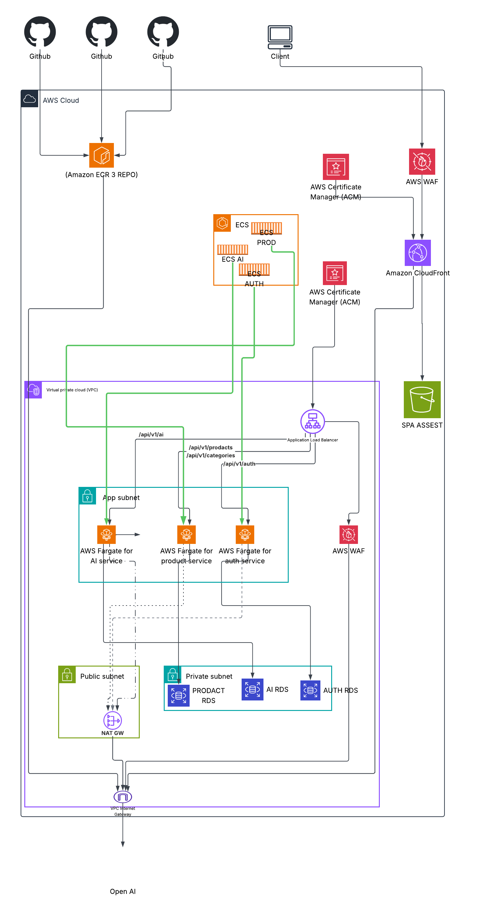

# E-Commerce Platform Documentation

Distributed e-commerce platform built as a microservices architecture with four independently deployable components: an Auth service, a Products service, an AI service, and a Vue frontend — deployed on AWS using ECS Fargate, path-based ALB routing, and per-service RDS instances.

## Repositories

| Component | Repository | Stack |
|---|---|---|
| Auth Service | `ecommerce-auth-service` | Laravel, MySQL, Redis |
| Products Service | `ecommerce-prodacts-service` | Node.js, TypeScript, PostgreSQL, DDD |
| AI Service | `ecommerce-ai-service-` | FastAPI, Python, RAG, pgvector |
| Frontend | `ecommerce-frontend` | Vue 3, TypeScript, Vite, Tailwind CSS |

## Documentation Index

| Document | Description |
|---|---|
| Diagrams & Schemas | Visual illustrations — architecture, structure, ER diagrams, flows |
| Architecture | System design, service boundaries, communication patterns |
| Development Guide | Local setup for all services (Make, Docker, scripts) |
| **AWS Deployment** (this document) | VPC, ALB, ECS Fargate, RDS, ECR, S3, CloudFront, WAF, NAT, Secrets Manager, CI/CD |
| Auth Service | Authentication, authorization, API reference |
| Products Service | Catalog, search, stock |
| AI Service | Recommendations, RAG descriptions, pgvector |
| Frontend | Vue SPA, roles, build scripts, environment configuration |

## Platform Overview

The platform supports three user roles:

| Role | Capabilities |
|---|---|
| Customer | Register, login, browse products, search catalog, view product details |
| Support | View and search users (read-only user management) |
| Admin | Full CRUD on products and categories, user management, role assignment |

## High-Level Application Flow

1. User registers or logs in through the Frontend → Auth Service.
2. Auth Service returns an RS256 JWT (Laravel Passport).
3. Frontend sends the JWT on requests to Auth, Products, and AI APIs.
4. Products and AI verify the JWT signature using the Auth Service public key (no call to Auth on every request).
5. Product search uses PostgreSQL full-text search (`tsvector` + GIN) on the Products RDS.
6. AI recommendations and RAG descriptions use embeddings on a dedicated RDS PostgreSQL with `pgvector`, and call the OpenAI API for generation.

---

# AWS Architecture

## 1. Infrastructure overview



> **Line legend:** solid(black) = data flow or verify

>  solid(green) = control plane (ECS launching a task)

> dotted = internet egress via NAT.

## 2. Network architecture

| Layer | CIDR (example) | Contains | Internet access |
|---|---|---|---|
| Public subnet | `10.0.1.0/24` | NAT Gateway | Direct, via Internet Gateway |
| App subnet (private) | `10.0.2.0/24` | Fargate tasks: auth, product, AI | Outbound only, via NAT Gateway |
| Data subnet (private) | `10.0.3.0/24` | AUTH RDS, PRODUCT RDS, AI RDS | None |

**Route tables**

| Subnet | Destination | Target |
|---|---|---|
| Public | `0.0.0.0/0` | Internet Gateway |
| App (private) | `0.0.0.0/0` | NAT Gateway |
| Data (private) | — | Local only, no default route |


## 3. Security Groups

Each tier has its own Security Group; access is granted by **referencing the source Security Group**, never by CIDR, so rules stay correct even if IPs change.

| Security Group | Inbound | Outbound |
|---|---|---|
| `sg-alb` | 443 from `0.0.0.0/0` (or WAF-fronted CloudFront IP ranges only, if origin access is restricted) | 8080/3000/8000 to `sg-auth`, `sg-product`, `sg-ai` |
| `sg-auth` (Fargate) | App port (e.g. 8000) from `sg-alb` only | 3306 to `sg-auth-rds`; 443 to `0.0.0.0/0` via NAT (ECR, Secrets Manager, CloudWatch) |
| `sg-product` (Fargate) | App port (e.g. 3000) from `sg-alb` only | 5432 to `sg-product-rds`; 443 to `0.0.0.0/0` via NAT |
| `sg-ai` (Fargate) | App port (e.g. 8080) from `sg-alb` only | 5432 to `sg-ai-rds`; 443 to `0.0.0.0/0` via NAT (ECR, Secrets Manager, CloudWatch, **OpenAI API**) |
| `sg-auth-rds` | 3306 from `sg-auth` only | None (databases don't need outbound) |
| `sg-product-rds` | 5432 from `sg-product` only | None |
| `sg-ai-rds` | 5432 from `sg-ai` only | None |
| `sg-nat` | N/A (NAT Gateway is not SG-attached; controlled via subnet route tables) | — |

**Design rule:** no service's Security Group ever references another service's Security Group directly (e.g. `sg-auth` cannot reach `sg-product-rds`). Cross-service isolation is enforced at the network layer, not just at the application/JWT layer.

## 4. Network ACLs (NACLs)

NACLs are stateless and subnet-wide, used here as a **coarse second layer** behind Security Groups (defense in depth), not as the primary control:

| Subnet | Inbound allow | Outbound allow |
|---|---|---|
| Public | 443 from `0.0.0.0/0`; ephemeral ports (1024–65535) for return traffic | All, to support NAT-forwarded responses |
| App (private) | Ephemeral ports from ALB subnet CIDR | 3306/5432 to data subnet CIDR; 443 to public subnet CIDR (NAT) |
| Data (private) | 3306/5432 from app subnet CIDR only | Ephemeral ports back to app subnet CIDR |

NACL rules are intentionally broader than Security Group rules — **Security Groups are the actual enforcement point** for service-to-service isolation; NACLs exist to catch misconfigured Security Groups and satisfy compliance requirements for network-layer segmentation.

## 5. Secrets Manager

Every service reads its database credentials from **AWS Secrets Manager** at container start — no credentials are stored in Task Definitions, environment variables, or source control.

| Secret | Consumed by | Contents |
|---|---|---|
| `prod/auth/db` | auth-service task | password |
| `prod/product/db` | product-service task |  password |
| `prod/ai/db` | ai-service task |  password |
| `prod/ai/openai-key` | ai-service task | OpenAI API key |
| `prod/auth/jwt-signing-key` | auth-service task | Passport RS256 private key |


- **Execution Role** (used by the ECS agent, not application code) has permission to pull the container image and, if injecting secrets directly into environment variables via Task Definition `secrets` block, to read the specific secret ARN.
- **Task Role** (used by application code, if the app reads secrets at runtime instead) is scoped to `secretsmanager:GetSecretValue` on that service's specific secret ARNs only — `auth`'s task role cannot read `prod/ai/openai-key`.
- Secrets are encrypted at rest with a customer-managed KMS key; rotation is enabled on the three DB secrets with a 30-day schedule via a Secrets Manager rotation Lambda.
- No secret is ever logged; CloudWatch log groups are scanned for accidental credential leakage as part of CI checks.

## 6. Data flow: CI/CD → ECR → ECS → Fargate

Two independent paths converge on the running task — a **control path** and a **data path**. Conflating them is a common documentation mistake; keeping them separate here matches how AWS actually implements them.


1. **Build & push (control of what)**: GitHub Actions authenticates to AWS via **OIDC federation** — no long-lived IAM access keys stored in GitHub. It builds the image and pushes it to the matching ECR repository.
2. **Deploy trigger (control of when)**: The GitHub Actions workflow updates the ECS Task Definition (new image tag) and calls `ecs update-service`. ECS Service reconciles desired vs. running count and schedules new tasks — this is an **AWS API call**, no image bytes move here.
3. **Image pull (the actual data)**: The Fargate agent for the new task authenticates to ECR and pulls the image layers. In this environment that pull happens **through the NAT Gateway → Internet Gateway path** (a deliberate choice — see [ADR-1](#adr-1-nat-gateway-vs-vpc-interface-endpoints-for-ecr)), not through a VPC Interface Endpoint.
4. **Rollout**: ECS deployment circuit breaker is enabled — if new tasks fail health checks against the ALB target group, the deployment automatically rolls back to the previous task definition revision.


## 8. Data flow: AI service egress to OpenAI


The AI service is the only service with a legitimate reason to reach a non-AWS external endpoint. This is why NAT Gateway exists in this design at all — Auth and Products never need to leave AWS, and if AI's OpenAI dependency were removed, the platform could migrate entirely to VPC Interface Endpoints and drop NAT Gateway (and its cost) altogether.

## 9. Architecture Decision Records

### ADR-1: NAT Gateway vs. VPC Interface Endpoints for ECR

**Decision:** use NAT Gateway for both ECR image pulls and OpenAI calls, instead of provisioning separate VPC Interface Endpoints for `ecr.api` / `ecr.dkr` / `logs`.

**Why:** the AI service already requires a NAT Gateway to reach OpenAI (no PrivateLink exists for third-party SaaS APIs). Since the fixed hourly cost of NAT Gateway is already incurred, routing ECR pulls through the same NAT avoids paying for redundant Interface Endpoints (~$0.01/hour per endpoint per AZ) with limited additional benefit.

**Trade-off accepted:** ECR traffic now traverses a path that is technically internet-routed (though still TLS-encrypted and IAM-authenticated) instead of staying entirely within AWS's private backbone. NAT Gateway also becomes a shared dependency for both deployments and AI functionality — if it fails or saturates, both are affected simultaneously.

**Revisit if:** the AI/OpenAI dependency is removed (migrate fully to VPC Endpoints and drop NAT), or if deployment frequency grows enough that NAT data-processing charges exceed the fixed cost of Interface Endpoints, or if compliance requirements mandate that image pulls never traverse a path that touches an Internet Gateway.

### ADR-2: Single Security Group per service, not per subnet

**Decision:** enforce service-to-service isolation via Security Groups referencing each other by SG-ID, with subnets used only for routing/AZ placement, not as a security boundary.

**Why:** a Subnet's job in AWS is CIDR allocation and AZ association — it is not an access-control primitive. Placing all three Fargate services in one app subnet (instead of one subnet per service) simplifies CIDR planning and route tables without weakening isolation, because the actual access control (which service can talk to which database, which service accepts traffic from the ALB) is enforced identically either way, at the Security Group level.

## 10. Roadmap / known gaps

This documents the current state honestly rather than overstating production-readiness:

| Gap | Impact | Priority |
|---|---|---|
| Single-AZ deployment | Full outage if the AZ has an issue — affects ALB target availability, all Fargate tasks, all RDS instances, and NAT Gateway simultaneously | High — required before serving production traffic at scale |
| No RDS Multi-AZ / automated failover | Extended downtime on instance failure per database | High — pairs with the AZ gap above |
| No Auto Scaling policies on ECS services | Fixed capacity; a traffic spike can degrade or drop requests | Medium |
| No WAF managed rule groups documented | Baseline protection may be incomplete against common web exploits | Medium |
| No cross-region backup strategy for RDS snapshots | Regional disaster recovery not yet defined | Medium |
| No CloudWatch alarms / SNS notification path documented | Operational visibility into failures is manual | Medium |

---

# Production Endpoints

Backend APIs are exposed through an Application Load Balancer behind a regional WAF. ECS Fargate tasks run in the private app subnet; databases live on RDS in the private data subnet. The frontend is served from S3 via CloudFront with an edge WAF.

| Resource | URL |
|---|---|
| Frontend | `https://<cloudfront-domain>` (S3 + CloudFront + WAF) |
| API (ALB) | `https://<alb-dns-name>/api/v1` |

Swagger / OpenAPI is disabled in production. Interactive API docs are available in local/dev only.

---

# Quick Start (Full Stack Locally)

Each service is Dockerized and includes Makefile targets plus bash production scripts.

```bash
# 1. Auth Service
git clone https://github.com/WaelAlQawasmi/ecommerce-auth-service.git
cd ecommerce-auth-service
make up          # or: bash run-production.sh

# 2. Products Service
git clone https://github.com/WaelAlQawasmi/ecommerce-prodacts-service.git
cd ecommerce-prodacts-service
make docker-up   # requires PASSPORT_PUBLIC_KEY from Auth Service

# 3. AI Service
git clone https://github.com/WaelAlQawasmi/ecommerce-ai-service-.git
cd ecommerce-ai-service-
docker-compose up -d

# 4. Frontend
git clone https://github.com/WaelAlQawasmi/ecommerce-frontend.git
cd ecommerce-frontend
npm install
npm run dev
```

See Development Guide for detailed setup and AWS Deployment for production.

---

# Design Principles

- **Microservices** — Independent deployable services with clear bounded contexts
- **Per-service data** — Auth MySQL, Products PostgreSQL, AI PostgreSQL + pgvector
- **TDD** — Test-driven development on Auth (PHPUnit) and Products (Jest)
- **DDD** — Domain-Driven Design in the Products service
- **Docker-first** — Each service ships with Docker Compose and health checks
- **API Gateway pattern** — ALB path-based routing to backend services
- **Defense in depth** — dual WAF (edge + regional), Security-Group-based isolation, no static credentials anywhere in the pipeline
- **CI/CD** — GitHub Actions with IAM OIDC, ECR, ECS deployment circuit breaker with automatic rollback

# License

This project is part of a microservices-based e-commerce platform created for learning, portfolio development, and distributed systems practice.