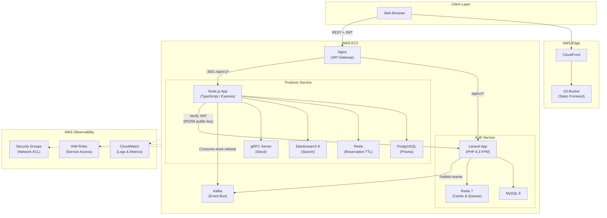

# System Architecture

## Architecture Diagram



## Service Boundaries

### Auth Service

**Responsibility:** Identity, authentication, authorization, and user lifecycle.

| Concern | Implementation |
|---------|----------------|
| Authentication | Laravel Passport (OAuth2, JWT access + refresh tokens) |
| Authorization | Role-based access control (admin, support, customer) |
| Persistence | MySQL |
| Caching | Redis (user count, session-adjacent data) |
| Async | Redis queues (welcome email), Kafka event publishing |
| API style | REST `/api/v1` |
| Docs | OpenAPI via Scramble |

**Publishes to Kafka:**

- `user.registered` — new user signup
- `user.logged-in` — successful login
- `user.logged-out` — logout

### Products Service

**Responsibility:** Product catalog, categories, search, and stock management.

| Concern | Implementation |
|---------|----------------|
| Catalog CRUD | REST `/api/v1` (admin write, authenticated read) |
| Search | Elasticsearch full-text search |
| Stock reservation | gRPC (`ReserveStock`, `GetStockAvailability`) |
| Stock release | Kafka consumer on `stock.release` topic |
| Persistence | PostgreSQL via Prisma ORM |
| Reservation TTL | Redis |
| Auth | RS256 JWT verification (Auth Service public key) |
| Architecture | DDD layers: domain → application → infrastructure → interfaces |
| Docs | Swagger UI |

### Frontend

**Responsibility:** Single-page application for all user roles.

| Concern | Implementation |
|---------|----------------|
| UI | Vue 3 + TypeScript + Tailwind CSS 4 |
| State | Pinia |
| Routing | Vue Router with role-based guards |
| HTTP | Axios with Bearer JWT interceptors |
| Dev proxy | Vite proxy to backend APIs (avoids CORS) |
| Production | Static build deployed to S3 + CloudFront |

## Communication Patterns

### Synchronous (REST)

```
Frontend ──JWT──▶ Auth Service     (login, register, users, roles)
Frontend ──JWT──▶ Products Service (products, categories, search)
```

All protected endpoints require:

```
Authorization: Bearer <access_token>
```

### Synchronous (gRPC)

Internal service-to-service stock operations use gRPC on port `50051`:

```
Order Service ──gRPC──▶ Products Service
                         ReserveStock(product_id, order_id, quantity, ttl)
                         GetStockAvailability(product_id)
```

### Asynchronous (Kafka)

| Topic | Publisher | Consumer | Payload |
|-------|-----------|----------|---------|
| `user.registered` | Auth | (future services) | `{ event, user_id, email }` |
| `user.logged-in` | Auth | (future services) | `{ event, user_id }` |
| `user.logged-out` | Auth | (future services) | `{ event, user_id }` |
| `stock.release` | Order/other | Products | `{ orderId, reservationId? }` |

## Authentication Flow

```mermaid
sequenceDiagram
    participant C as Client (Frontend)
    participant A as Auth Service
    participant P as Products Service

    C->>A: POST /api/v1/auth/login
    A->>A: Validate credentials
    A->>A: Laravel Passport → RS256 JWT
    A-->>C: access_token + refresh_token + user

    C->>P: GET /api/v1/products (Bearer JWT)
    P->>P: Verify RS256 signature (PASSPORT_PUBLIC_KEY)
    P->>P: Check exp, nbf, extract roles
    P-->>C: Product list
```



### JWT Verification (Products Service)

1. Algorithm must be **RS256** (no HS256)
2. Signature verified with Auth Service RSA public key
3. Token not expired (`exp` > now, `nbf` <= now)
4. Extract `id`, `email`, `role[]` for authorization

## Data Stores

| Service | Primary DB | Cache | Search | Messaging |
|---------|-----------|-------|--------|-----------|
| Auth | MySQL | Redis | — | Kafka |
| Products | PostgreSQL | Redis | Elasticsearch | Kafka |
| Frontend | — (stateless) | sessionStorage (JWT) | — | — |

## API Gateway (Nginx)

Nginx on EC2 acts as the reverse proxy and API gateway:

| Route | Upstream |
|-------|----------|
| `/api/v1/*` (port 80) | Auth Service (Laravel via PHP-FPM) |
| `:3001/api/v1/*` | Products Service (Node.js) |
| `/docs/api` | Auth OpenAPI documentation |

The frontend is **not** served by EC2 Nginx in production — it is hosted on **S3** and delivered through **CloudFront**.

## Security Model

| Layer | Control |
|-------|---------|
| Network | AWS Security Groups (restrict inbound to 80, 443, 3001 as needed) |
| Identity | IAM roles for EC2 instance access to CloudWatch, S3 deploy |
| Application | OAuth2 / JWT, RBAC, rate limiting, Helmet headers |
| Transport | HTTPS via CloudFront (frontend), TLS configurable on Nginx |
| Secrets | Passport keys, DB credentials in `.env` (never committed) |

## Testing Strategy (TDD)

| Service | Framework | Coverage |
|---------|-----------|----------|
| Auth | PHPUnit (`php artisan test`) | Roles, repositories, authorization policies, registration |
| Products | Jest + Supertest | Unit (domain, use cases, JWT) + integration (HTTP API) |
| Frontend | Manual / future E2E | Role guards, API integration |

## Repository Structure (Per Service)

Each microservice follows a consistent operational layout:

```
service/
├── Dockerfile
├── docker-compose.yml
├── Makefile              # Dev shortcuts (make help)
├── run-production.sh     # One-command prod stack (Linux/macOS)
├── run-production.bat    # Windows equivalent (Auth only)
├── .env.example
└── tests/                # TDD test suites
```

Products service additionally provides `docker-compose.minimal.yml` for lightweight infra-only runs.
