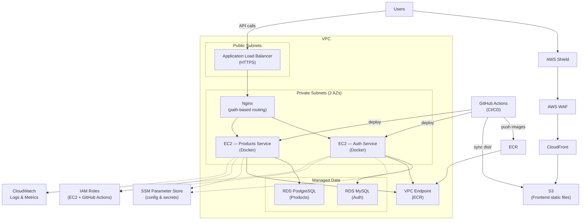
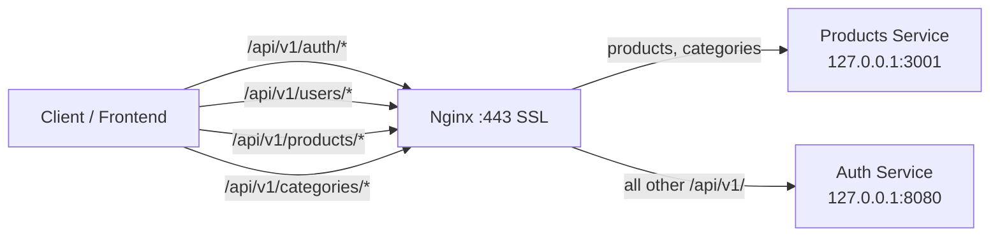

# AWS Deployment Guide

Production runs in a **VPC** with **private subnets**, **EC2** for microservices, **RDS** per service, **ECR** for container images, **ALB** as the API entry point, **S3 + CloudFront + WAF + Shield** for the frontend, **SSM** for configuration, **IAM roles** for access, and **GitHub Actions** for CI/CD.

## Infrastructure Overview



## Components

| Component | AWS Service | Purpose |
|-----------|-------------|---------|
| Network | VPC + 2 private subnets | Isolate EC2 and RDS; multi-AZ layout |
| Backend services | EC2 (private subnets) | Host Docker containers (Auth, Products, Redis, Kafka, ES) |
| Databases | RDS (MySQL + PostgreSQL) | Managed per-service persistence |
| Container registry | ECR + VPC endpoint | Private image pulls without internet gateway |
| API entry | ALB + Nginx (on EC2) | HTTPS termination at ALB; path routing to services |
| Frontend | S3 + CloudFront | Static SPA hosting with CDN |
| Edge protection | AWS WAF + Shield | DDoS mitigation and request filtering |
| Configuration | SSM Parameter Store | Secrets and environment config |
| Access control | IAM roles | EC2 instance role + GitHub Actions OIDC role |
| CI/CD | GitHub Actions | Build, test, push ECR, deploy backend and frontend |
| Logging | CloudWatch | Centralized logs and metrics |
| Network rules | Security Groups | Least-privilege inbound/outbound |

## VPC & Networking

### Layout

| Layer | Subnets | Resources |
|-------|---------|-----------|
| Edge | — | CloudFront, WAF, Shield |
| Public | 2 AZs | ALB, NAT Gateway (for outbound from private subnets) |
| Private | 2 AZs | EC2 (Auth, Products), Nginx |
| Data | Private | RDS MySQL (Auth), RDS PostgreSQL (Products) |

### VPC Endpoints

| Endpoint | Type | Purpose |
|----------|------|---------|
| ECR API + ECR DKR | Interface | Pull container images without public internet |
| SSM / SSMMessages / EC2Messages | Interface | SSM Session Manager and Parameter Store access |
| S3 | Gateway (optional) | Frontend artifact uploads from CI/CD |

### Security Groups

| Group | Inbound | Outbound |
|-------|---------|----------|
| ALB | HTTPS 443 from `0.0.0.0/0` | EC2 app ports (8080, 3001, 443) |
| EC2 (Auth / Products) | From ALB security group only | RDS, Redis, Kafka, VPC endpoints, CloudWatch |
| RDS (Auth) | MySQL 3306 from Auth EC2 SG | — |
| RDS (Products) | PostgreSQL 5432 from Products EC2 SG | — |

Do **not** expose backend service ports, SSH, or database ports to the public internet. Use **SSM Session Manager** for admin access to private EC2 instances.

---

## RDS (Per Service)

Each microservice uses a dedicated **RDS** instance instead of containerized databases.

| Service | Engine | Notes |
|---------|--------|-------|
| Auth | RDS MySQL 8 | Multi-AZ recommended; SG allows Auth EC2 only |
| Products | RDS PostgreSQL | Multi-AZ recommended; SG allows Products EC2 only |

Store connection strings in **SSM Parameter Store** (e.g. `/ecommerce/auth/DB_HOST`, `/ecommerce/products/DATABASE_URL`). EC2 instances read them at deploy time via the IAM instance role.

Redis, Elasticsearch, and Kafka remain on EC2 in Docker (or migrate to ElastiCache / OpenSearch / MSK as needed).

---

## ECR & Container Deployment

### 1. Create ECR Repositories

```bash
aws ecr create-repository --repository-name ecommerce/auth-service
aws ecr create-repository --repository-name ecommerce/products-service
```

### 2. VPC Endpoint for ECR

Create interface VPC endpoints for `com.amazonaws.<region>.ecr.api` and `com.amazonaws.<region>.ecr.dkr` so private EC2 instances can pull images without a public IP.

### 3. Build & Push (local or CI)

```bash
aws ecr get-login-password --region us-east-1 | \
  docker login --username AWS --password-stdin <account-id>.dkr.ecr.us-east-1.amazonaws.com

docker build -t ecommerce/auth-service .
docker tag ecommerce/auth-service:latest <account-id>.dkr.ecr.us-east-1.amazonaws.com/ecommerce/auth-service:latest
docker push <account-id>.dkr.ecr.us-east-1.amazonaws.com/ecommerce/auth-service:latest
```

### 4. Pull on EC2

EC2 instances in private subnets pull from ECR via the VPC endpoint. The IAM instance role needs `AmazonEC2ContainerRegistryReadOnly`.

---

## Application Load Balancer (ALB)

The **ALB** sits in public subnets and is the sole public API entry point.

| Setting | Value |
|---------|-------|
| Scheme | Internet-facing |
| Listener | HTTPS 443 (ACM certificate) |
| Target group | EC2 instance(s) running Nginx on 443 or 80 |
| Health check | `/api/v1/health` or Nginx `/` |

Attach **AWS WAF** to the ALB (and CloudFront) for rate limiting, geo blocking, and managed rule sets.

---

## EC2 Backend Deployment

### 1. Launch EC2 Instances (Private Subnets)

- **AMI:** Amazon Linux 2023 or Ubuntu 22.04 LTS
- **Instance type:** t3.medium or larger (Elasticsearch + Kafka need memory)
- **Subnet:** Private subnet (one per AZ for high availability)
- **Public IP:** Disabled — access via SSM Session Manager
- **Storage:** 30 GB+ EBS volume
- **IAM role:** Attach instance profile (see below)

### 2. IAM Role for EC2

Attach an IAM role to each EC2 instance:

| Policy / Permission | Purpose |
|---------------------|---------|
| `CloudWatchAgentServerPolicy` | Ship logs and metrics to CloudWatch |
| `AmazonEC2ContainerRegistryReadOnly` | Pull images from ECR via VPC endpoint |
| `AmazonSSMReadOnlyAccess` | Read SSM Parameter Store config |
| Custom S3 policy (scoped) | Optional — frontend deploy from instance |
| Custom policy | Least-privilege RDS, SSM paths, CloudWatch log groups |

Example custom S3 policy (scoped to frontend bucket):

```json
{
  "Version": "2012-10-17",
  "Statement": [
    {
      "Effect": "Allow",
      "Action": ["s3:PutObject", "s3:GetObject", "s3:ListBucket", "s3:DeleteObject"],
      "Resource": [
        "arn:aws:s3:::your-ecommerce-frontend-bucket",
        "arn:aws:s3:::your-ecommerce-frontend-bucket/*"
      ]
    }
  ]
}
```

### 3. SSM Parameter Store

Store production secrets and config in SSM (SecureString for passwords):

| Parameter | Example path |
|-----------|--------------|
| Auth DB host | `/ecommerce/auth/DB_HOST` |
| Auth DB credentials | `/ecommerce/auth/DB_PASSWORD` |
| Products DB URL | `/ecommerce/products/DATABASE_URL` |
| Passport keys | `/ecommerce/auth/PASSPORT_*` |
| Kafka broker | `/ecommerce/shared/KAFKA_BROKER` |

Deploy scripts or GitHub Actions fetch these at runtime using the instance / OIDC IAM role.

### 4. Install Dependencies on EC2

```bash
# Connect via SSM Session Manager (no SSH key needed)
aws ssm start-session --target i-xxxxxxxxxxxxxxxxx

# Install Docker
sudo yum update -y
sudo yum install -y docker git
sudo systemctl start docker
sudo systemctl enable docker
sudo usermod -aG docker ec2-user

# Install Docker Compose
sudo curl -L "https://github.com/docker/compose/releases/latest/download/docker-compose-$(uname -s)-$(uname -m)" -o /usr/local/bin/docker-compose
sudo chmod +x /usr/local/bin/docker-compose

# Install Nginx
sudo yum install -y nginx
sudo systemctl enable nginx
```

### 5. Deploy Auth Service

```bash
# Pull from ECR (example)
docker pull <account-id>.dkr.ecr.us-east-1.amazonaws.com/ecommerce/auth-service:latest

# Or clone and build locally on the instance
git clone https://github.com/WaelAlQawasmi/ecommerce-auth-service.git
cd ecommerce-auth-service

# Configure production .env from SSM parameters (DB_HOST → RDS endpoint)
cp .env.example .env
# Edit .env — point DB_* to RDS MySQL, not localhost

bash run-production.sh
```

### 6. Deploy Products Service

```bash
docker pull <account-id>.dkr.ecr.us-east-1.amazonaws.com/ecommerce/products-service:latest

git clone https://github.com/WaelAlQawasmi/ecommerce-prodacts-service.git
cd ecommerce-prodacts-service

cp .env.example .env
# Set DATABASE_URL to RDS PostgreSQL endpoint (from SSM)
# Set PASSPORT_PUBLIC_KEY from Auth Service
# Set NODE_ENV=production, SWAGGER_ENABLED=false

make docker-up
```

### 7. Configure Nginx as API Gateway

Nginx on EC2 receives traffic from the **ALB** and routes by URL path. Backend services bind to localhost only.

**Routing rules:**

| Path pattern | Backend | Port |
|--------------|---------|------|
| `/api/v1/products/*`, `/api/v1/categories/*` | Products Service | `127.0.0.1:3001` |
| `/api/v1/*` (everything else) | Auth Service | `127.0.0.1:8080` |

Production configuration (`/etc/nginx/conf.d/ecommerce.conf`):

```nginx
server {
    listen 443 ssl default_server;
    server_name _;

    ssl_certificate     /etc/nginx/ssl/nginx.crt;
    ssl_certificate_key /etc/nginx/ssl/nginx.key;

    # ================= PRODUCTS =================
    # Must be defined BEFORE the catch-all /api/v1/ block
    location ~ ^/api/v1/(products|categories)(.*)$ {
        proxy_pass http://127.0.0.1:3001;
        proxy_set_header Host $host;
        proxy_set_header X-Real-IP $remote_addr;
        proxy_set_header X-Forwarded-For $proxy_add_x_forwarded_for;
        proxy_set_header X-Forwarded-Proto $scheme;
    }

    # ================= AUTH =================
    location /api/v1/ {
        proxy_pass http://127.0.0.1:8080;
        proxy_set_header Host $host;
        proxy_set_header X-Real-IP $remote_addr;
        proxy_set_header X-Forwarded-For $proxy_add_x_forwarded_for;
        proxy_set_header X-Forwarded-Proto $scheme;
    }

    # Auth OpenAPI docs — omit in production (Swagger disabled)
    # location /docs/ {
    #     proxy_pass http://127.0.0.1:8080;
    #     proxy_set_header Host $host;
    #     proxy_set_header X-Real-IP $remote_addr;
    # }
}
```

> **Production:** Swagger / OpenAPI is **disabled** on both services. Do not expose `/docs/` or `/api/docs` through the gateway in production.



Reload Nginx after changes:

```bash
sudo nginx -t
sudo systemctl reload nginx
```

Adjust upstream ports (`8080`, `3001`) to match your Docker Compose port mappings.

---

## Frontend Deployment (S3 + CloudFront + WAF)

Protected by **AWS WAF** and **Shield** at the CloudFront edge.

### 1. Build Locally or in CI

```bash
cd ecommerce-frontend
cp .env.production.example .env.production
# Set production API URLs

./scripts/build-production.sh   # Linux/macOS
# or .\scripts\build-production.ps1  # Windows
```

Output is in `dist/`.

### 2. Create S3 Bucket

```bash
aws s3 mb s3://your-ecommerce-frontend-bucket
aws s3 website s3://your-ecommerce-frontend-bucket \
  --index-document index.html \
  --error-document index.html
```

Enable static website hosting. For SPA routing, redirect 404 → `index.html`.

### 3. Upload Build Artifacts

```bash
aws s3 sync dist/ s3://your-ecommerce-frontend-bucket --delete
```

### 4. Create CloudFront Distribution

| Setting | Value |
|---------|-------|
| Origin | S3 bucket (OAC recommended) |
| Default root object | `index.html` |
| Viewer protocol | Redirect HTTP to HTTPS |
| Custom error response | 403/404 → `/index.html` (200) for SPA routing |
| Cache behavior | Cache static assets; short TTL or no-cache for `index.html` |
| WAF | Associate AWS WAF web ACL |
| Shield | Standard (automatic) or Advanced (optional) |

### 5. Environment Variables at Build Time

Vite embeds env vars at build time. Production `.env.production`:

```env
VITE_AUTH_API_URL=https://<alb-dns-name>/api/v1
VITE_PRODUCTS_API_URL=https://<alb-dns-name>/api/v1
```

Rebuild and re-sync to S3 whenever API URLs change.

---

## CI/CD (GitHub Actions)

Each repository deploys independently via **GitHub Actions** with an **IAM OIDC role** (no long-lived AWS keys).

### IAM Role for GitHub Actions

1. Create an OIDC identity provider for `token.actions.githubusercontent.com`.
2. Create an IAM role with trust policy scoped to your repo (`repo:WaelAlQawasmi/ecommerce-*`).
3. Attach policies: ECR push, S3 sync, SSM read, EC2/SSM deploy (as needed).

### Typical Workflow (Frontend)

```yaml
name: Deploy Frontend
on:
  push:
    branches: [main]

permissions:
  id-token: write
  contents: read

jobs:
  deploy:
    runs-on: ubuntu-latest
    steps:
      - uses: actions/checkout@v4

      - uses: actions/setup-node@v4
        with:
          node-version: 20

      - run: npm ci && npm run build
        env:
          VITE_AUTH_API_URL: ${{ secrets.VITE_AUTH_API_URL }}
          VITE_PRODUCTS_API_URL: ${{ secrets.VITE_PRODUCTS_API_URL }}

      - uses: aws-actions/configure-aws-credentials@v4
        with:
          role-to-assume: arn:aws:iam::<account-id>:role/github-actions-deploy
          aws-region: us-east-1

      - run: aws s3 sync dist/ s3://your-ecommerce-frontend-bucket --delete

      - run: aws cloudfront create-invalidation --distribution-id ${{ secrets.CF_DIST_ID }} --paths "/*"
```

### Typical Workflow (Backend)

1. Run tests (PHPUnit / Jest).
2. Build Docker image.
3. Push to **ECR**.
4. SSM Run Command on private EC2 to pull the new image and restart containers.

Store `VITE_*` URLs, bucket names, and distribution IDs in **GitHub Secrets**; store DB passwords and Passport keys in **SSM Parameter Store**.

---

## CloudWatch Configuration

### Install CloudWatch Agent on EC2

```bash
sudo yum install -y amazon-cloudwatch-agent
```

Example agent config (`/opt/aws/amazon-cloudwatch-agent/etc/amazon-cloudwatch-agent.json`):

```json
{
  "logs": {
    "logs_collected": {
      "files": {
        "collect_list": [
          {
            "file_path": "/var/log/nginx/access.log",
            "log_group_name": "/ecommerce/nginx/access",
            "log_stream_name": "{instance_id}"
          },
          {
            "file_path": "/var/log/nginx/error.log",
            "log_group_name": "/ecommerce/nginx/error",
            "log_stream_name": "{instance_id}"
          }
        ]
      }
    }
  },
  "metrics": {
    "namespace": "Ecommerce/EC2",
    "metrics_collected": {
      "cpu": { "measurement": ["cpu_usage_idle", "cpu_usage_user"] },
      "disk": { "measurement": ["used_percent"], "resources": ["/"] },
      "mem": { "measurement": ["mem_used_percent"] }
    }
  }
}
```

Start the agent:

```bash
sudo /opt/aws/amazon-cloudwatch-agent/bin/amazon-cloudwatch-agent-ctl \
  -a fetch-config -m ec2 \
  -c file:/opt/aws/amazon-cloudwatch-agent/etc/amazon-cloudwatch-agent.json -s
```

### Docker Container Logs

Forward Docker logs to CloudWatch using the `awslogs` log driver in `docker-compose.yml`:

```yaml
services:
  app:
    logging:
      driver: awslogs
      options:
        awslogs-group: /ecommerce/auth-service
        awslogs-region: us-east-1
        awslogs-stream-prefix: app
```

---

## Production Checklist

### Network & Security

- [ ] VPC with private subnets for EC2 and RDS
- [ ] EC2 has no public IP; admin access via SSM Session Manager
- [ ] ALB is the only public API entry; WAF attached to ALB and CloudFront
- [ ] Security groups: ALB → EC2 only; EC2 → RDS only
- [ ] RDS not publicly accessible; Multi-AZ enabled
- [ ] ECR VPC endpoints configured for private image pulls
- [ ] Passport private key in SSM (not in git)
- [ ] `NODE_ENV=production`, `SWAGGER_ENABLED=false` on Products
- [ ] HTTPS via ACM on ALB and CloudFront

### Services

- [ ] Auth Service connected to RDS MySQL + Redis + Kafka
- [ ] Products Service connected to RDS PostgreSQL + Redis + Elasticsearch + Kafka
- [ ] `SWAGGER_ENABLED=false` on Products; Auth OpenAPI disabled in production
- [ ] Nginx / ALB does **not** expose `/docs/` or `/api/docs` publicly
- [ ] Passport public key synced to Products Service
- [ ] Container images in ECR; EC2 pulls via VPC endpoint

### Frontend & CI/CD

- [ ] Production build with correct `VITE_*` URLs (ALB base URL)
- [ ] S3 bucket synced; CloudFront + WAF active
- [ ] SPA routing works (deep links resolve)
- [ ] GitHub Actions OIDC role configured with least privilege
- [ ] GitHub Secrets for build-time vars; SSM for runtime secrets

### Observability

- [ ] CloudWatch agent installed on EC2
- [ ] Log groups for Nginx, Docker, and ALB access logs
- [ ] EC2 and RDS metrics in CloudWatch dashboard
- [ ] Alarms for CPU, disk, RDS connections, and 5xx rates (optional)

---

## Production URLs

| Resource | URL |
|----------|-----|
| Frontend | `https://<cloudfront-domain>` |
| API Gateway (ALB) | `https://<alb-dns-name>/api/v1` |

Swagger / OpenAPI is **not available** in production (disabled on both services).

---

## Updating Services

### Backend (via CI/CD or manual)

```bash
# CI/CD: push to main → GitHub Actions builds, pushes ECR, deploys via SSM

# Manual on EC2 (via SSM Session Manager):
docker pull <account-id>.dkr.ecr.us-east-1.amazonaws.com/ecommerce/auth-service:latest
cd ecommerce-auth-service && bash run-production.sh

docker pull <account-id>.dkr.ecr.us-east-1.amazonaws.com/ecommerce/products-service:latest
cd ../ecommerce-prodacts-service && make docker-restart
```

### Frontend (via CI/CD or manual)

```bash
cd ecommerce-frontend
git pull
./scripts/build-production.sh
aws s3 sync dist/ s3://your-ecommerce-frontend-bucket --delete
aws cloudfront create-invalidation --distribution-id YOUR_DIST_ID --paths "/*"
```
