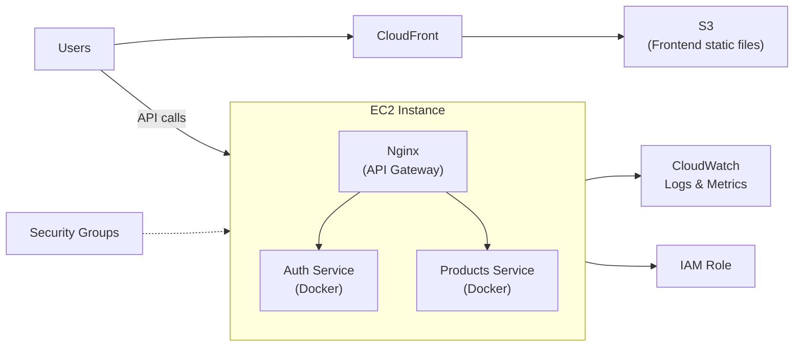

# AWS Deployment Guide

Production deployment uses **AWS EC2** for backend microservices, **S3 + CloudFront** for the frontend, **Nginx** as the API gateway, and **CloudWatch** for observability.

## Infrastructure Overview



## Components

| Component | AWS Service | Purpose |
|-----------|-------------|---------|
| Backend services | EC2 | Host Docker containers (Auth, Products, Kafka, databases) |
| API Gateway | Nginx (on EC2) | Reverse proxy, route `/api/v1` to services |
| Frontend | S3 + CloudFront | Static SPA hosting with CDN |
| Logging | CloudWatch | Centralized logs and metrics |
| Access control | IAM | EC2 instance role for AWS API access |
| Network | Security Groups | Inbound/outbound traffic rules |

## EC2 Backend Deployment

### 1. Launch EC2 Instance

- **AMI:** Amazon Linux 2023 or Ubuntu 22.04 LTS
- **Instance type:** t3.medium or larger (Elasticsearch + Kafka need memory)
- **Storage:** 30 GB+ EBS volume
- **Key pair:** For SSH access

### 2. Security Groups

Configure inbound rules based on least privilege:

| Type | Port | Source | Purpose |
|------|------|--------|---------|
| HTTP | 80 | 0.0.0.0/0 | Auth API via Nginx |
| HTTPS | 443 | 0.0.0.0/0 | TLS (recommended) |
| Custom TCP | 3001 | 0.0.0.0/0 | Products REST API |
| SSH | 22 | Your IP only | Administration |

Restrict database ports (3306, 5432, 6379, 9092, 9200) to **internal/VPC only** — never expose them publicly.

Outbound: allow all (or restrict to required AWS endpoints for CloudWatch, S3).

### 3. IAM Role for EC2

Attach an IAM role to the EC2 instance with policies such as:

| Policy | Purpose |
|--------|---------|
| `CloudWatchAgentServerPolicy` | Ship logs and metrics to CloudWatch |
| `AmazonS3FullAccess` (or scoped bucket policy) | Deploy frontend artifacts to S3 |
| Custom policy | Least-privilege access to specific resources |

Example custom S3 policy (scoped to frontend bucket):

```json
{
  "Version": "2012-10-17",
  "Statement": [
    {
      "Effect": "Allow",
      "Action": ["s3:PutObject", "s3:GetObject", "s3:ListBucket", "s3:DeleteObject"],
      "Resource": [
        "arn:aws:s3:::your-ecommerce-frontend-bucket",
        "arn:aws:s3:::your-ecommerce-frontend-bucket/*"
      ]
    }
  ]
}
```

### 4. Install Dependencies on EC2

```bash
# SSH into instance
ssh -i your-key.pem ec2-user@54.160.228.203

# Install Docker
sudo yum update -y
sudo yum install -y docker git
sudo systemctl start docker
sudo systemctl enable docker
sudo usermod -aG docker ec2-user

# Install Docker Compose
sudo curl -L "https://github.com/docker/compose/releases/latest/download/docker-compose-$(uname -s)-$(uname -m)" -o /usr/local/bin/docker-compose
sudo chmod +x /usr/local/bin/docker-compose

# Install Nginx
sudo yum install -y nginx
sudo systemctl enable nginx
```

### 5. Deploy Auth Service

```bash
git clone https://github.com/WaelAlQawasmi/ecommerce-auth-service.git
cd ecommerce-auth-service

# Configure production .env (DB passwords, Passport keys, Kafka broker)
cp .env.example .env
# Edit .env with production values

bash run-production.sh
# Or: docker-compose up -d --build
```

### 6. Deploy Products Service

```bash
git clone https://github.com/WaelAlQawasmi/ecommerce-prodacts-service.git
cd ecommerce-prodacts-service

cp .env.example .env
# Set PASSPORT_PUBLIC_KEY from Auth Service
# Set NODE_ENV=production, SWAGGER_ENABLED=false

make docker-up
# Or production-equivalent docker-compose command
```

### 7. Configure Nginx as API Gateway

Example Nginx configuration (`/etc/nginx/conf.d/ecommerce.conf`):

```nginx
upstream auth_backend {
    server 127.0.0.1:9000;  # PHP-FPM or Docker-mapped port
}

upstream products_backend {
    server 127.0.0.1:3001;
}

server {
    listen 80;
    server_name 54.160.228.203;

    # Auth Service
    location /api/v1/ {
        proxy_pass http://auth_backend;
        proxy_set_header Host $host;
        proxy_set_header X-Real-IP $remote_addr;
        proxy_set_header X-Forwarded-For $proxy_add_x_forwarded_for;
        proxy_set_header X-Forwarded-Proto $scheme;
    }

    # Auth OpenAPI docs
    location /docs/ {
        proxy_pass http://auth_backend;
        proxy_set_header Host $host;
    }
}

server {
    listen 3001;
    server_name 54.160.228.203;

    location / {
        proxy_pass http://products_backend;
        proxy_set_header Host $host;
        proxy_set_header X-Real-IP $remote_addr;
        proxy_set_header X-Forwarded-For $proxy_add_x_forwarded_for;
    }
}
```

Reload Nginx after changes:

```bash
sudo nginx -t
sudo systemctl reload nginx
```

Adjust upstream ports to match your Docker Compose port mappings.

---

## Frontend Deployment (S3 + CloudFront)

### 1. Build Locally or in CI

```bash
cd ecommerce-frontend
cp .env.production.example .env.production
# Set production API URLs

./scripts/build-production.sh   # Linux/macOS
# or .\scripts\build-production.ps1  # Windows
```

Output is in `dist/`.

### 2. Create S3 Bucket

```bash
aws s3 mb s3://your-ecommerce-frontend-bucket
aws s3 website s3://your-ecommerce-frontend-bucket \
  --index-document index.html \
  --error-document index.html
```

Enable static website hosting. For SPA routing, redirect 404 → `index.html`.

### 3. Upload Build Artifacts

```bash
aws s3 sync dist/ s3://your-ecommerce-frontend-bucket --delete
```

### 4. Create CloudFront Distribution

| Setting | Value |
|---------|-------|
| Origin | S3 bucket (or S3 website endpoint) |
| Default root object | `index.html` |
| Viewer protocol | Redirect HTTP to HTTPS |
| Custom error response | 403/404 → `/index.html` (200) for SPA routing |
| Cache behavior | Cache static assets; short TTL or no-cache for `index.html` |

### 5. Environment Variables at Build Time

Vite embeds env vars at build time. Production `.env.production`:

```env
VITE_AUTH_API_URL=http://54.160.228.203/api/v1
VITE_PRODUCTS_API_URL=http://54.160.228.203:3001/api/v1
```

Rebuild and re-sync to S3 whenever API URLs change.

---

## CloudWatch Configuration

### Install CloudWatch Agent on EC2

```bash
sudo yum install -y amazon-cloudwatch-agent
```

Example agent config (`/opt/aws/amazon-cloudwatch-agent/etc/amazon-cloudwatch-agent.json`):

```json
{
  "logs": {
    "logs_collected": {
      "files": {
        "collect_list": [
          {
            "file_path": "/var/log/nginx/access.log",
            "log_group_name": "/ecommerce/nginx/access",
            "log_stream_name": "{instance_id}"
          },
          {
            "file_path": "/var/log/nginx/error.log",
            "log_group_name": "/ecommerce/nginx/error",
            "log_stream_name": "{instance_id}"
          }
        ]
      }
    }
  },
  "metrics": {
    "namespace": "Ecommerce/EC2",
    "metrics_collected": {
      "cpu": { "measurement": ["cpu_usage_idle", "cpu_usage_user"] },
      "disk": { "measurement": ["used_percent"], "resources": ["/"] },
      "mem": { "measurement": ["mem_used_percent"] }
    }
  }
}
```

Start the agent:

```bash
sudo /opt/aws/amazon-cloudwatch-agent/bin/amazon-cloudwatch-agent-ctl \
  -a fetch-config -m ec2 \
  -c file:/opt/aws/amazon-cloudwatch-agent/etc/amazon-cloudwatch-agent.json -s
```

### Docker Container Logs

Forward Docker logs to CloudWatch using the `awslogs` log driver in `docker-compose.yml`:

```yaml
services:
  app:
    logging:
      driver: awslogs
      options:
        awslogs-group: /ecommerce/auth-service
        awslogs-region: us-east-1
        awslogs-stream-prefix: app
```

---

## Production Checklist

### Security

- [ ] Security groups restrict SSH to admin IPs only
- [ ] Database and Kafka ports not exposed publicly
- [ ] Passport private key stored securely (not in git)
- [ ] `NODE_ENV=production`, `SWAGGER_ENABLED=false` on Products
- [ ] HTTPS enabled (CloudFront for frontend; consider ACM + Nginx for API)
- [ ] Rate limiting enabled on both services

### Services

- [ ] Auth Service running with MySQL, Redis, Kafka
- [ ] Products Service running with PostgreSQL, Redis, Elasticsearch, Kafka
- [ ] Nginx routing verified (`/api/v1`, port 3001)
- [ ] Passport public key synced to Products Service

### Frontend

- [ ] Production build with correct `VITE_*` URLs
- [ ] S3 bucket synced
- [ ] CloudFront distribution active
- [ ] SPA routing works (deep links resolve)

### Observability

- [ ] CloudWatch agent installed and running
- [ ] Log groups created for Nginx and Docker containers
- [ ] EC2 metrics visible in CloudWatch dashboard
- [ ] Alarms configured for CPU, disk, and error rates (optional)

---

## Production URLs

| Resource | URL |
|----------|-----|
| Auth API | http://54.160.228.203/api/v1 |
| Auth Docs | http://54.160.228.203/docs/api |
| Products API | http://54.160.228.203:3001/api/v1 |
| Products Swagger | http://54.160.228.203:3001/api/docs |

Replace with your CloudFront domain for the frontend once configured.

---

## Updating Services

### Backend (rolling update)

```bash
cd ecommerce-auth-service
git pull
bash run-production.sh

cd ../ecommerce-prodacts-service
git pull
make docker-restart
```

### Frontend

```bash
cd ecommerce-frontend
git pull
./scripts/build-production.sh
aws s3 sync dist/ s3://your-ecommerce-frontend-bucket --delete
aws cloudfront create-invalidation --distribution-id YOUR_DIST_ID --paths "/*"
```
