# Platform Diagrams & Schemas

Visual illustrations of the e-commerce platform architecture, project structure, data models, and request flows.

---

## 1. Platform Overview

High-level view of all components and how they connect.

```mermaid
flowchart LR
    subgraph Users
        U[Browser / Mobile]
    end

    subgraph AWS["AWS Cloud"]
        CF[CloudFront CDN]
        S3[(S3\nFrontend SPA)]

        subgraph EC2["EC2 Instance"]
            NGX[Nginx\nAPI Gateway]

            subgraph Auth["Auth Service"]
                LA[Laravel + Passport]
            end

            subgraph Products["Products Service"]
                NA[Node.js + Express]
                GR[gRPC Stock Server]
            end

            KF{{Kafka}}
        end

        CW[CloudWatch]
        IAM[IAM Role]
        SG[Security Groups]
    end

    U -->|HTTPS static assets| CF --> S3
    U -->|REST + JWT HTTPS :443| NGX
    NGX -->|/api/v1/products|categories| NA
    NGX -->|other /api/v1/*| LA
    LA --> KF
    NA --> KF
    NA -.->|RS256 public key| LA
    EC2 -.-> CW
    EC2 -.-> IAM
    EC2 -.-> SG
```

---

## 2. AWS Production Infrastructure

Detailed deployment topology on AWS (VPC, private subnets, ALB, RDS, ECR, WAF).

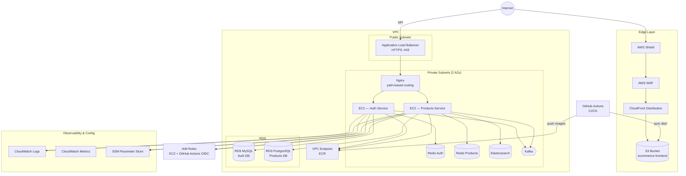

### Security Group Rules

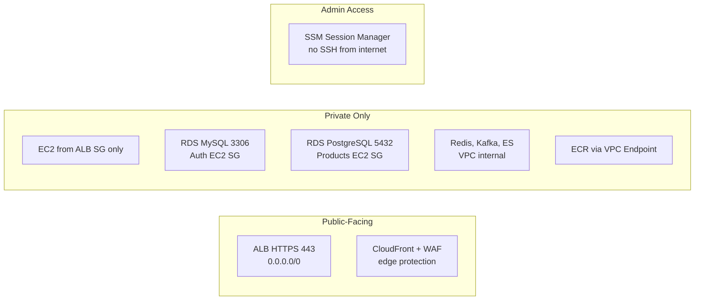

---

## 3. Nginx API Gateway Routing

ALB terminates HTTPS and forwards to Nginx on EC2. Nginx routes by path to internal backends.

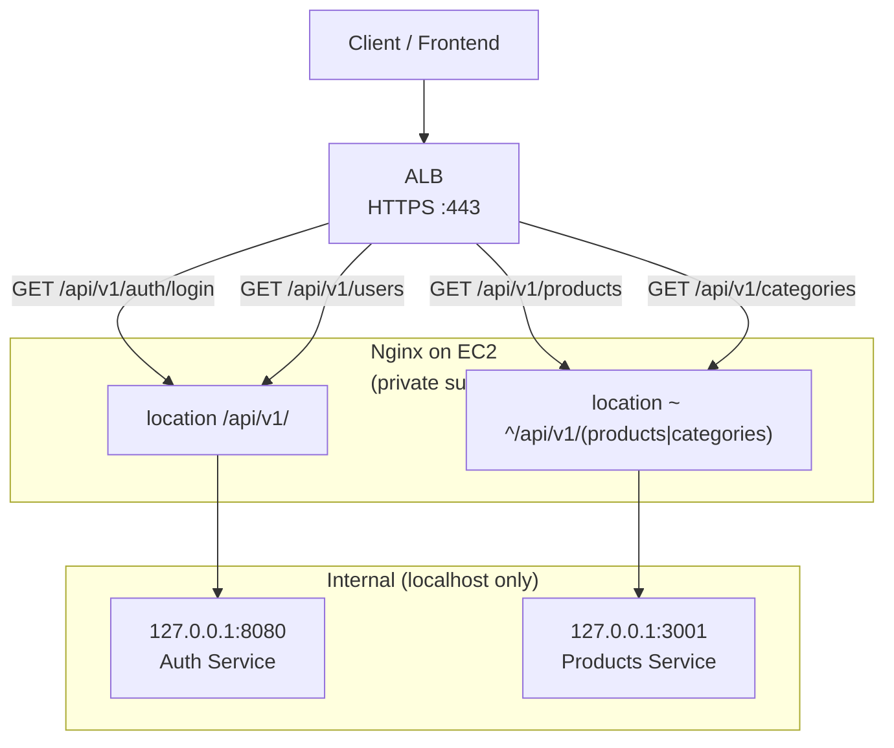

| Path | Upstream | Port |
|------|----------|------|
| `/api/v1/products/*`, `/api/v1/categories/*` | Products Service | `127.0.0.1:3001` |
| `/api/v1/*` (auth, users, roles, …) | Auth Service | `127.0.0.1:8080` |

> **Production:** `/docs/*` (Auth) and `/api/docs` (Products) are **disabled** — do not route them through the gateway.

**Note:** The products/categories `location` block must be defined **before** the catch-all `/api/v1/` block in Nginx.

---

## 4. Repository Structure (All Services)

Three independent Git repositories that compose the platform.

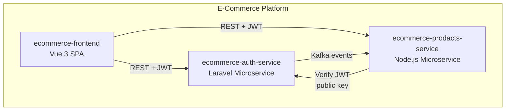

### 4.1 Auth Service Structure

```
ecommerce-auth-service/
├── app/                    # Laravel application code
│   ├── Http/
│   │   ├── Controllers/  # API controllers
│   │   └── Middleware/     # RBAC, rate limiting
│   ├── Models/             # User, Role
│   ├── Policies/           # Authorization policies
│   ├── Events/             # UserRegistered, UserLoggedIn
│   └── Listeners/          # SendWelcomeEmail, FlushUserCountCache
├── bootstrap/
├── config/                 # App, DB, Redis, Kafka, Passport
├── database/
│   ├── migrations/         # users, roles, role_user
│   └── seeders/
├── docker/                 # Nginx, PHP configs
├── docs/                   # Service documentation
├── routes/
│   └── api.php             # /api/v1 routes
├── tests/                  # PHPUnit (TDD)
├── Dockerfile
├── docker-compose.yml
├── Makefile                # make up, migrate, seed
├── run-production.sh       # One-command prod stack
└── README.md
```

### 4.2 Products Service Structure (DDD)

```
ecommerce-prodacts-service/
├── src/
│   ├── domain/             # Entities, value objects, repo interfaces
│   │   ├── entities/       # Product, Category, StockReservation
│   │   └── repositories/   # Repository interfaces
│   ├── application/        # Use cases (business logic)
│   │   └── use-cases/      # CreateProduct, ReserveStock, SearchProducts
│   ├── infrastructure/     # External adapters
│   │   ├── database/       # Prisma repositories
│   │   ├── elasticsearch/  # Search adapter
│   │   ├── kafka/          # Stock release consumer
│   │   ├── grpc/           # Stock gRPC server + proto
│   │   └── jwt/            # RS256 verification
│   ├── interfaces/         # HTTP REST + Swagger
│   │   └── http/           # Express routes, controllers
│   └── main.ts             # Bootstrap & DI wiring
├── prisma/
│   ├── schema.prisma       # DB schema
│   └── migrations/
├── tests/
│   ├── unit/               # Domain, use cases, JWT
│   └── integration/        # HTTP API (Supertest)
├── scripts/
├── Dockerfile
├── docker-compose.yml
├── Makefile                # make docker-up, test, dev
└── README.md
```

### 4.3 Frontend Structure

```
ecommerce-frontend/
├── public/                 # Static assets
├── scripts/
│   ├── build-production.sh # Linux/macOS prod build
│   └── build-production.ps1# Windows prod build
├── src/
│   ├── api/
│   │   ├── client.ts       # Axios + JWT interceptors
│   │   ├── auth.api.ts     # Auth Service calls
│   │   └── products.api.ts # Products Service calls
│   ├── components/
│   │   ├── common/         # Modal, Pagination, Alert, Spinner
│   │   ├── layout/         # AppHeader
│   │   └── products/       # ProductCard
│   ├── layouts/
│   │   ├── AppLayout.vue   # Shop layout
│   │   └── DashboardLayout.vue  # Admin/Support layout
│   ├── router/
│   │   └── index.ts        # Routes + role guards
│   ├── stores/
│   │   └── auth.store.ts   # Pinia auth state
│   ├── types/
│   │   └── index.ts        # TypeScript interfaces
│   ├── utils/
│   │   ├── helpers.ts      # Token storage
│   │   └── roles.ts        # Role constants
│   ├── views/
│   │   ├── auth/           # Login, Register
│   │   ├── shop/           # Shop, ProductDetail
│   │   ├── admin/          # Dashboard, Products, Categories, Users
│   │   └── support/        # Dashboard, Users
│   ├── App.vue
│   └── main.ts
├── docs/                   # Platform documentation
├── .env.example
├── .env.production.example
├── vite.config.ts          # Dev proxy config
└── README.md
```

---

## 5. Frontend Route & Role Schema

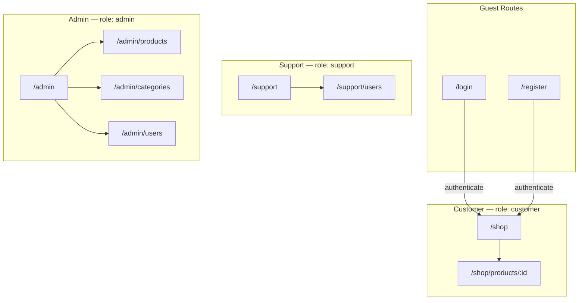

| Role | Default redirect | Allowed areas |
|------|------------------|---------------|
| `customer` | `/shop` | Shop, product details |
| `support` | `/support` | Support dashboard, user search |
| `admin` | `/admin` | Full admin + inherits support access |

---

## 6. Authentication & Authorization Flow

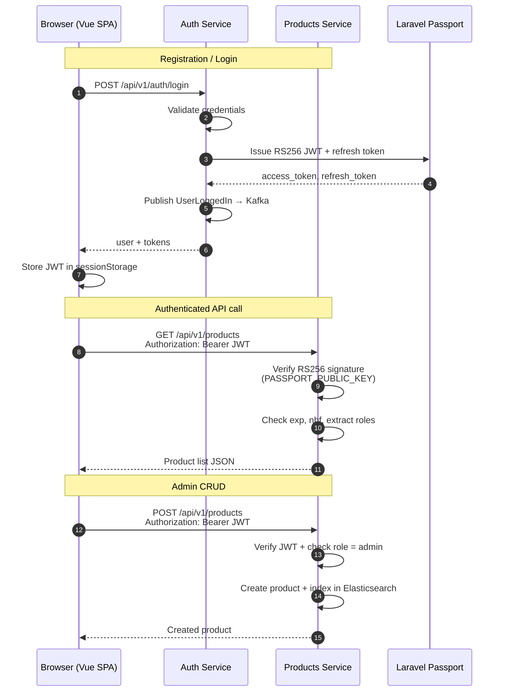

---

## 7. Event-Driven Architecture (Kafka)

```mermaid
flowchart LR
    subgraph Producers
        AUTH[Auth Service]
        ORDER[Order Service\n(future)]
    end

    subgraph Kafka["Kafka Event Bus"]
        T1[user.registered]
        T2[user.logged-in]
        T3[user.logged-out]
        T4[stock.release]
    end

    subgraph Consumers
        PROD[Products Service]
        NOTIFY[Notification Service\n(future)]
        ANALYTICS[Analytics\n(future)]
    end

    AUTH -->|publish| T1
    AUTH -->|publish| T2
    AUTH -->|publish| T3
    ORDER -->|publish| T4

    T4 -->|consume| PROD
    T1 -.->|future| NOTIFY
    T2 -.->|future| ANALYTICS
```

### Kafka Topic Schemas

**user.registered**
```json
{
  "event": "UserRegistered",
  "user_id": 1,
  "email": "john@example.com"
}
```

**user.logged-in**
```json
{
  "event": "UserLoggedIn",
  "user_id": 1
}
```

**stock.release**
```json
{
  "orderId": "order-123",
  "reservationId": "uuid-optional"
}
```

---

## 8. Stock Reservation Flow (gRPC + Kafka)

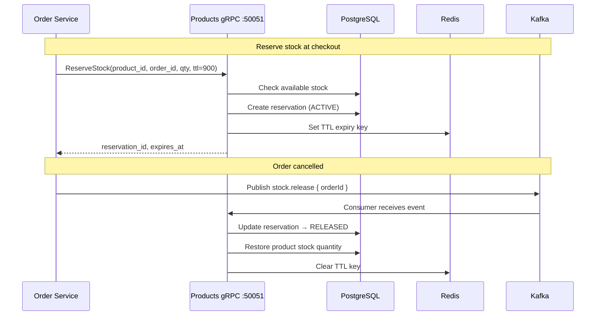

---

## 9. Database Schemas

### 9.1 Auth Service (MySQL)

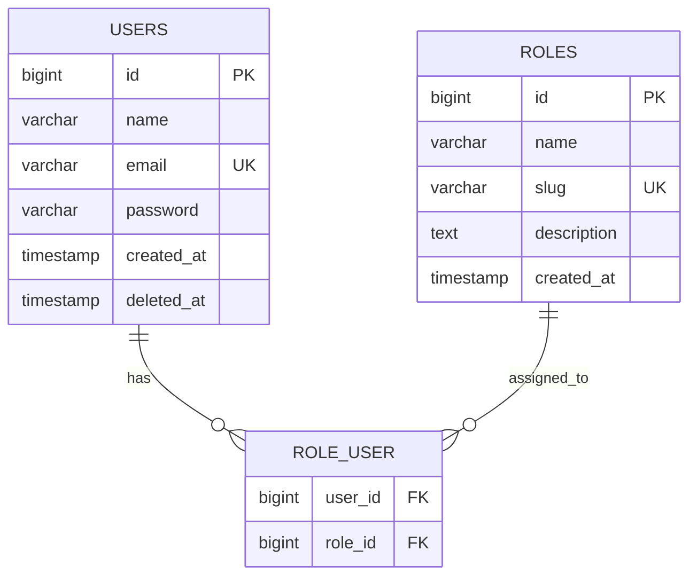

**Role slugs:** `admin`, `support`, `customer`

### 9.2 Products Service (PostgreSQL)

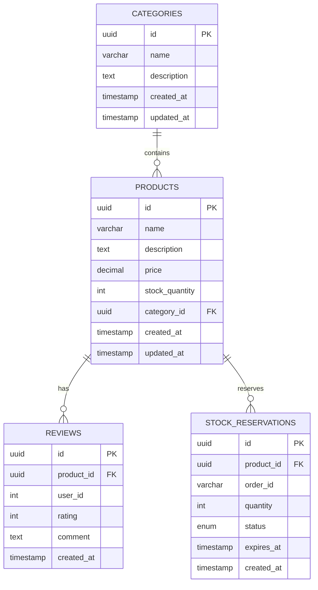

**Reservation status:** `ACTIVE` | `RELEASED` | `CONFIRMED`

---

## 10. Products Service — DDD Layer Schema

How requests flow through Domain-Driven Design layers.

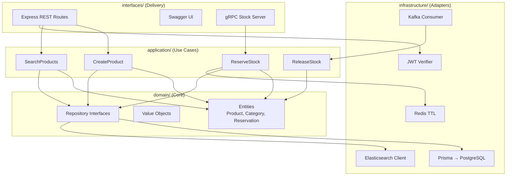

---

## 11. Auth Service — Internal Layer Schema

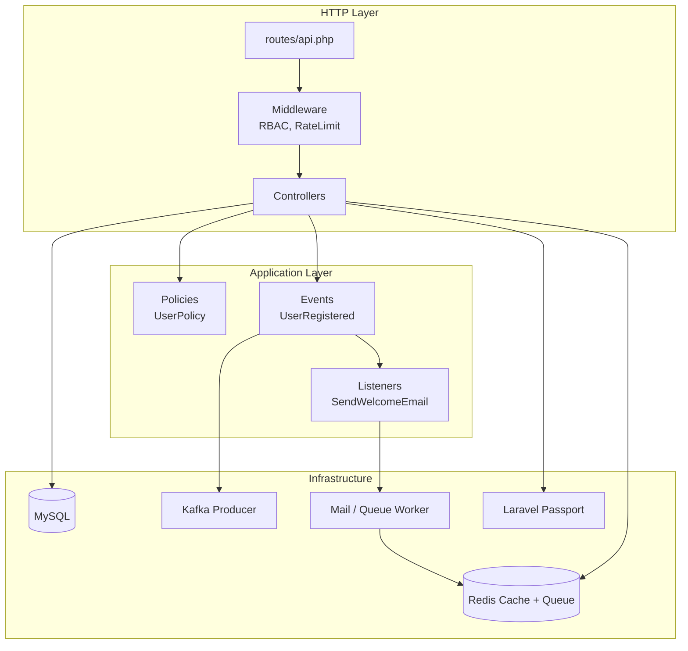

---

## 12. Frontend Data Flow

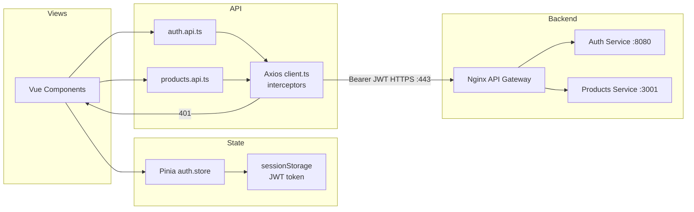

---

## 13. Development vs Production Topology

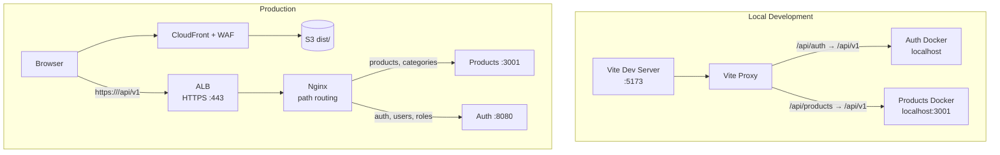

| Environment | Frontend | Auth API URL | Products API URL |
|-------------|----------|--------------|------------------|
| Development | Vite `:5173` | `/api/auth` (proxy) | `/api/products` (proxy) |
| Production | S3 + CloudFront + WAF | `https://<alb-dns-name>/api/v1` | `https://<alb-dns-name>/api/v1` |

---

## 14. Build & Deploy Pipeline (GitHub Actions)

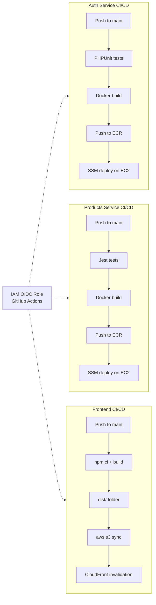

---

## 15. Tech Stack Map

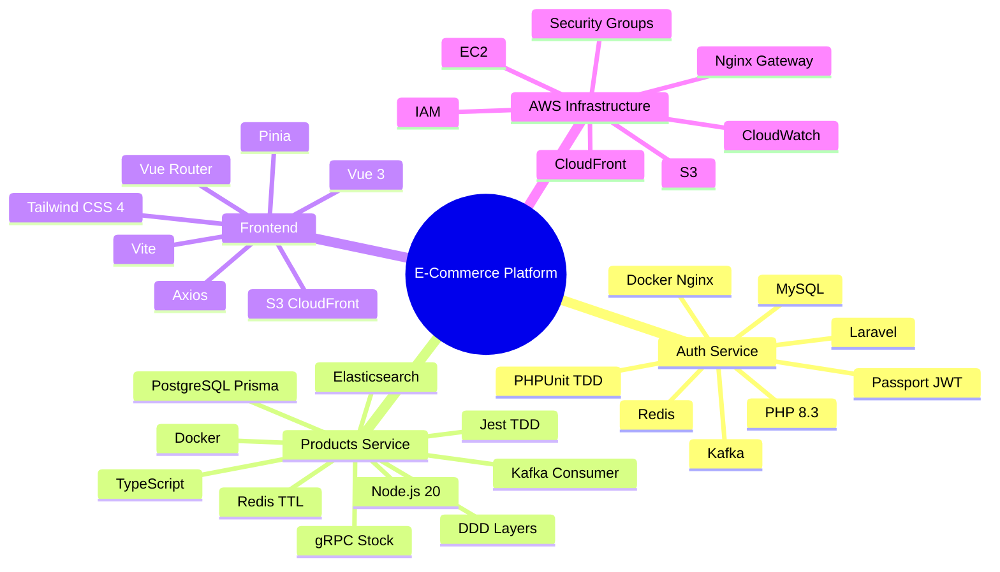

---

## Related Documentation

- [Architecture](./architecture.md) — Detailed architecture narrative
- [AWS Deployment](./deployment-aws.md) — Step-by-step deployment guide
- [Development Guide](./development.md) — Local setup instructions
